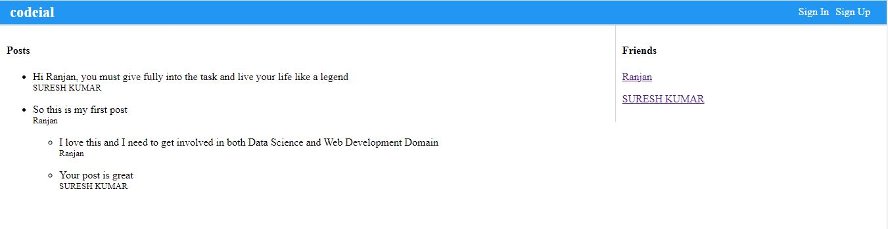
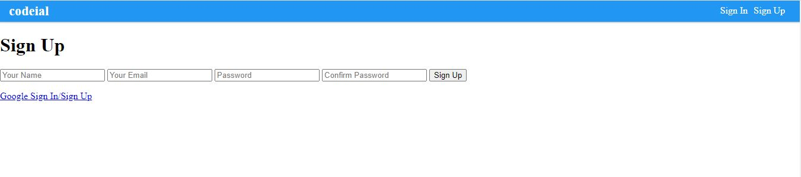
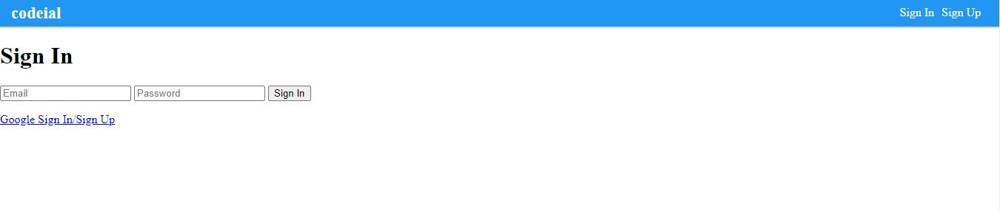
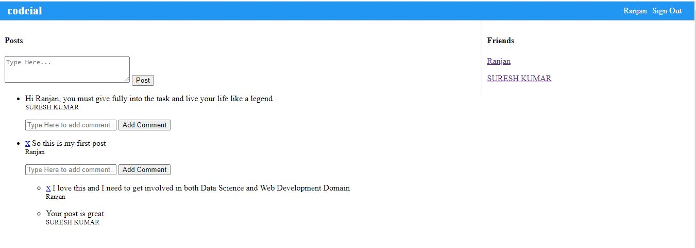
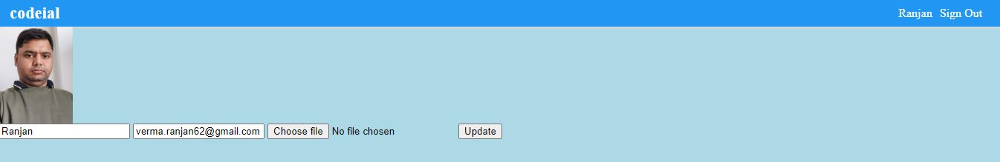

# CODEIAL APP

The CODEIAL APP is basically created for creating POSTS and commenting on the POSTS so as to share opinions on the respective POSTS. We can also add friends. There is also profile updation page on which we can upload documents(here images).

In this App, I mainly deal with following tasks:

- It uses **MVC** Architecture and **Node.js** along with **Express** framework. \*
- It uses **MongoDB** database and **Mongoose** as ORM
- The **Authentication** is done with **passport** API present in npm. It is widely used for authentication purpose.

To review the App, let us see how the App is working, through images 👍

It is the Front Page, in which all the Posts and Friends who signed in are mentioned.

On right side, if we click on **Sign Up** we will see below page :

There is also Sign In page as follows :

When we sign in, then it will send us to the page where we can share our post and can comment on the posts shared by others.

Now we can fill the information or upload the file so as to complete the profile.

### It is a brief view of how the application is working. You can easily run the App with npm start after cloning from github.
